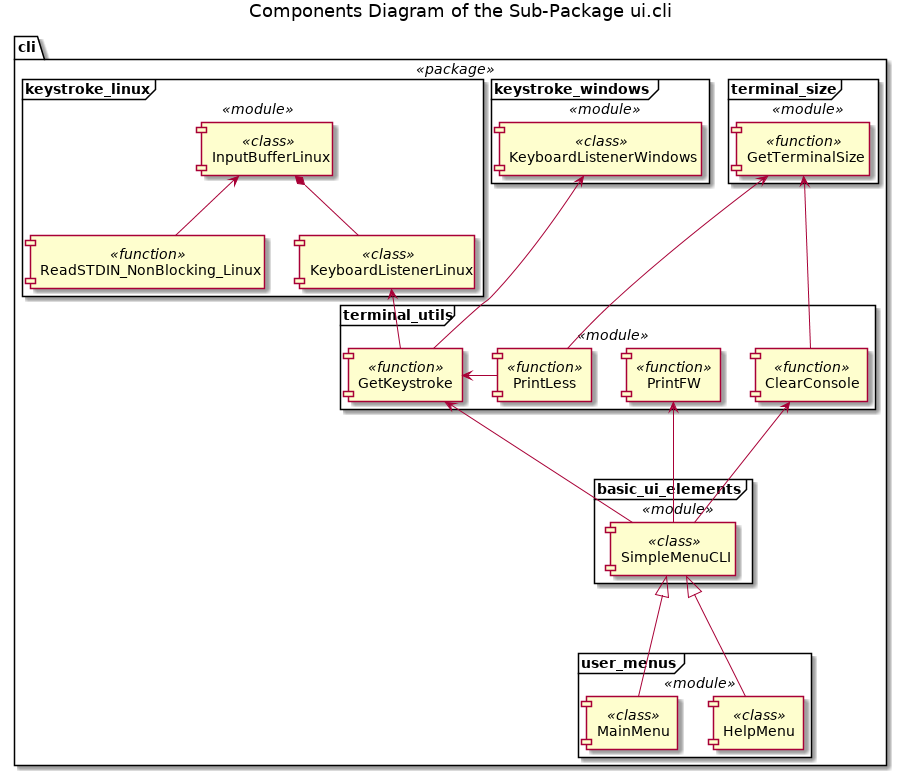

# Package sudoku_py.ui.cli

## Documentation

Modules

* [basic_ui_elements](./ui_cli_basic_ui_elements.md)
* [keystroke_linux](./ui_cli_keystroke_linux.md)
* [keystroke_windows](./ui_cli_keystroke_windows.md)
* [terminal_size](./ui_cli_terminal_size.md)
* [terminal_utils](./ui_cli_terminal_utils.md)
* [user_menus](./ui_cli_tuser_menus.md)

## Structure

