# Module ui.cli.keystroke_linux

## Goals

This module implements the POSIX OS (e.g., LInux) specific keyboard listener, which should detect a keyboard`s key press event and return a string (unicode) representation of the pressed key. This module is complementary to the MS Winsdows keystroke listener implementation (see [documentation](./ui_cli_keystroke_windows.md)), as it is defined in the problem analysis for the ui.cli.terminal_utils module (see [documentation](./ui_cli_terminal_utils.md))

The expected *modus operandi* is that a CLI user interface element (menu, dialog, etc.) will wait for the user input (key press) and perform some action afterwards based on the user input. Therefore, the process of the keyboard listening may be blocking. Such an UI element will expect either a Latin letter (small or capital, no diacritic signs) or a number entered by the user as the choice of an item / option. Thus, for instance, Shift+'1' keypress (resulting in the '!' character with English QWERTY layout) is not a valid input, which should be clearly differentiated from the plain '1' key press. In short, the result returned by the keyboard listener should be identical to the situation when a single character is entered via **stdin** (using **raw_input**() function), but without the necessity to finish the input with the Enter key. This also means that a letter key press using non-English keyboard layout may result in a different character being returned.

## Requirements

* The 'normal' keys - Latin letters (capital and small), numbers, arithmetic signs, punctuation signs, etc. - i.e. all characters with ASCII codes from 32 ('\x20') to 126 ('\x7e') inclusively - must be captured and properly represented; i.e. the keystroke 'q' + Shift (without Caps Lock) or simply 'q' with the Caps Lock should yield 'Q', '[' with Shift - '{', etc.
* The keys corresponding to the control symbols within ASCII - Esc, Backspace, Enter, Tab - must also be captured and returned in an unambiguous manner - either as C escape sequences '\r', '\b', '\t', or by their hex-code, e.g., '\x1b'
* The 'special' keys - cursor keys, Delete, Insert, Home, End, PageUp, PageDown, etc., which are represented by the (platform specific) escape sequences - must be captured and returned as an unambiguous string, e.g., as hex-code
* The 'modifier' keys - Shift, Alt, Ctrl - alone should not be registered as a key press, only in combination with the key that they modify; the resulting control sequences (like Cntrl-C, etc.) should be treated in the same way as the 'special' keys above
* The true Unicode characters as the resul of the key press on the non-English keyboard layout (e.g. Cyrillic) must be detected and properly represented as a Unicode character (u'\uxxxx' format)

## Problem Analysis

Upon internet search the popular solutions are:

* treat **stdin** as a file and read just one character (at the time) using **sys.stdin.read(1)**
* use the standard library **curses**
* use third party libraries, like **pygame**

The last option is unacceptable, because the design choice for the whole project is to minimize the dependence on the third party packages and to use only the standard library functionality as much as possible. The second option, technically, is not more elegant or simple as the first one, so the first option has been chosen.

The main obstacle is that in the usual mode the input from the **stdin** is not available, until the Enter key is pressed. Thus, even if a single (letter or number) key is pressed, and the corresonding character is sent to **stdin**, it cannot be read out until the Enter key is pressed. In other words, exactly as with the **raw_input**() function. The walk-around is to put the console into the 'raw' mode (using **tty** or **fcntl** modules), read the first byte in the buffer of the **stdin** and set the console back to the 'usual' (cbreak) mode, see References [^1] to [^4]. It is absolutely imperative to put the console back into the cbreak mode, otherwise the console output will be 'broken'. Basically, the '\n' (LF) character issued, for instance, by the **print** statement after the printed symbols will only move the console cursor to the next line, but it will not move it left to the beginning of the line. Thus, the explicit issue of the '\r' (CR) character will be required before each new line.

The other problem with this approach is that the **sys.stdin.read(1)** call will block the execution of the program if the **stdin** buffer is currently empty until it receives at least one byte. There is a way to overcome this blocking by periodically asking the **stdin** if it has anything in its bufer (using **select.select**(), see References [^1] to [^4]) before attempting to read from it. In between the checks on the data availability some useful activity may be performed.

Even better approach is to put the function listening the **stdin** into a separate thread (Reference [^2]), which will populate some buffer, whereas another function (in the main thread) will periodically check that buffer and take input from it. As soon as the required user input (keystrokes) is obtained, the **stdin** listening process can be stopped by sending an event (Reference [^5]) or directly setting some flag variable visible to the listening thread even if the buffer is not depleated. The advantage of this approach is that the keyboard listening becomes asynchrous and non-blocking. Therefore, it is selected for the implementation.

During the implementation and testing on Linux Mint (19, Mate edition, 64 bit) two effects have been found:

* a letter key press with non-English layout (Russian Cyrillic to be specific), naturally, generates a Unicode character, e.g. u'\u044f', which is sent into the **stdin** UTF-8 encoded as a *sequence* of bytes (2 bytes for the Cyrillic characters)
* a 'special' key press, as cursor keys, PageUp, Delete, etc., generate a control sequence of ASCII characters starting with ESC + '[' ('\x1b[') or ESC + 'O' ('\x1bO'), known as CSI and SS3 sequences, with the different length (3 to 5 characters)

The issue of a keystroke being represented by more than a single byte is resolved using double buffering and analysis of the current input.

The potential problem is that the user may press some keys (even unintentionally) between the calls to the buffer. For example, a user may press some keys in between the menus, BEFORE he was prompted for the input. Thus, the buffer will return not the key, which the user wanted to press in response to the prompt, but the first key pressed after the last buffer check. To address this situation the buffer has a finite 'lifetime' of the data whithin, and it clears periodically the not claimed input; and each new data palced into the buffer automatically removes the old one.

### References

[^1] [Stackoverflow question 21791621](htts://stackoverflow.com/questions/21791621/)

[^2] [Stackoverflow question 292095](htts://stackoverflow.com/questions/292095/)

[^3] [Stackoverflow question 2408560](htts://stackoverflow.com/questions/2408560/)

[^4] [MagMax at GitHub](https://github.com/magmax/python-readchar) . Original authors are [Danny Yo & Stephen Chappel at code.activestate.com](http://code.activestate.com/recipes/134892)

[^5] [Stackoverflow question 18018033](htts://stackoverflow.com/questions/18018033/)

## Design

The module implements one function and two classes (see figure below). The function is executed in a separate (from the main) thread. It listens to the **stdin** and accumulates the data one byte at a time until a proper byte sequence is accumulated, which can be converted into a unicode character or sent as CSI or SS3 sequence within a unicode string to a buffer object. This buffer object is shared by the main and the secondary threads and it is implemented as a custom class. The buffer always store data as a unicode string, which contains either a single proper unicode character in the u'\uxxxx' form (including ASCII characters) or a single CSI / SS3 sequence stored as it is (hex-codes). Any new input from the listening function purges the previously stored data and resets the data timer. The data in the buffer has a limited lifetime buffer; the expired data is deleted and never returned to the 'caller'. The second class implements a 'user interface' to the buffer object, which waits until any data is available in the buffer (blocking) and then retrieves the content of the buffer.

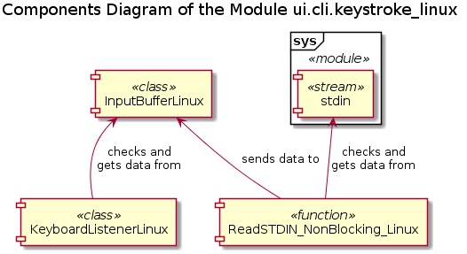

The class diagram of the module is given below.

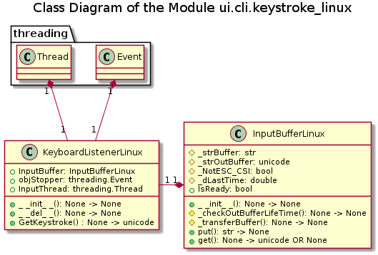

The 'user interface' class **KeyboardListenerLinux** is responsible for the creation of an instance of the buffer class **InputBufferLinux**, the second execution thread and the 'stopper event' object (to contol the second thread) upon own instantiation. It is also responsible for the proper termination of the second thread upon own 'destruction', whereas the buffer object and the 'stopper event' object are left to the automatic garbage collection mechanism to take care of. An UML sequence diagram (see below) is not designed for the multi-threading processes, still it illustrates the main aspects of the interaction between the involved objects.

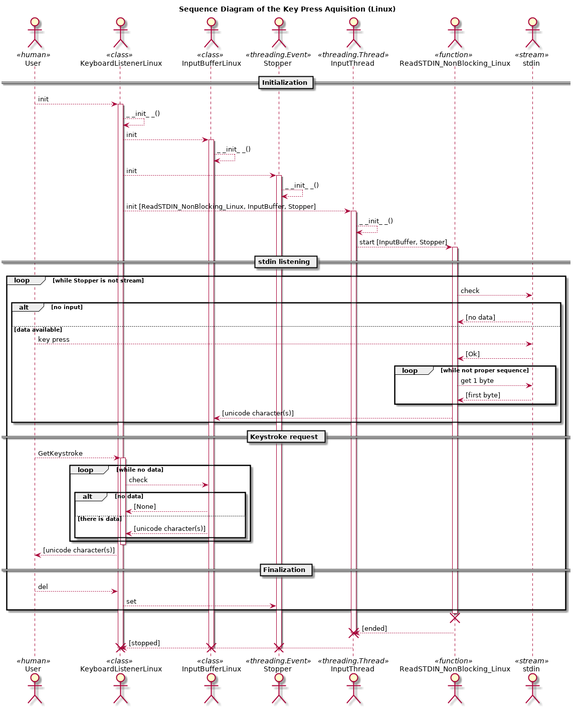

The first important point is that a user could press a key on the keyboard even before the initiation of the keyboard listening (e.g. 'laggy' CLI-based UI) or at any time after that. The keyboard listener (from the 'user interface' part) is blocking; it doesn't return / stop until any keystroke is registered, but it doesn't listen to the **stdin** directly - only checks if any data is available in the buffer, which is populated *asynchronously* from another thread.

The activity diagram below shows the interaction between the threads. It is an abstraction related to the 'user perspective' since, actually, only two threads are involved, not three as in the Diagram. However, the buffer object (middle) is shared by the both threads: the main ('user interface', left) and the secondary ('listener', right). The 'put' event from the secondary thread and the 'get' event from the main thread are *asynchronous*. Thus, 3 processes abstraction is an approximation of the 'racing' condition between the two threads with a shared data exchange object.

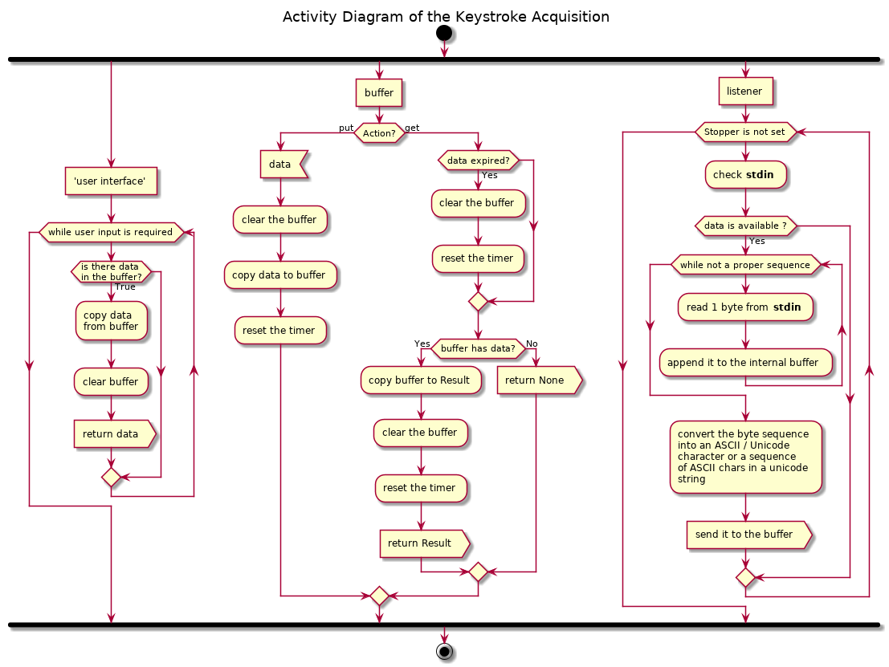

The activity diagram of the **stdin** listening function ReadSTDIN_NonBlocking_Linux() is shown below. Note that it 'remembers' the original configuration (settings) of the console upon the creation of the thread (entrance to the function) and, at least, tries to restore the original settings during the termination of the thread, which can occur either by setting the stopper event object into the 'set' state (normal termination) or if any exception has occured within the scope of the try clause. Note that the restoration of the original settings within the 'finally' clause is itself placed into another 'try clause'. Thus the restoration of the console configuration is not quaranteed if the **stdin** descriptor cannot be obtained.

This listener function implements own internal buffer, into which the input from the **stdin** is accumulated byte by byte, until the accumulated bytes can be interpreted either as a control sequence (CSI or SS3) or a single byte unicode character (ASCII character) or 2 to 4 bytes unicode character encoded using UTF-8. The following rules are applied:
* SS3 sequence is '\x1bO' + any ASCII character (< '\x80')
* CSI sequence may be:
  - '\x1b[' + any ASCII character (< '\x80'), but not a number, except '0' and '9'
  - '\x1b[' + one or more numbers ('0' to '9') + '~'
* If a byte is recieved, which breaks these patterns, the already accumulated sequence is dropped, and the last received byte is treated depending on its value:
  - '\x1b' (ESC) as the start of a new control sequence
  - any other character as the start of the UTF-8 encoded unicode character byte sequence
* The supposed encoded unicode character byte sequence is tested with each accumulated byte on if it can be already decoded - minimum encoding length principle, and a new byte is read out from the **stdin** only if the current sequence cannot be decoded
* The length of the UTF-8 encoded unicode character cannot exceed 4 bytes. As soon as the length of the sequence reaches 5, the first byte in the sequence is discarded.

 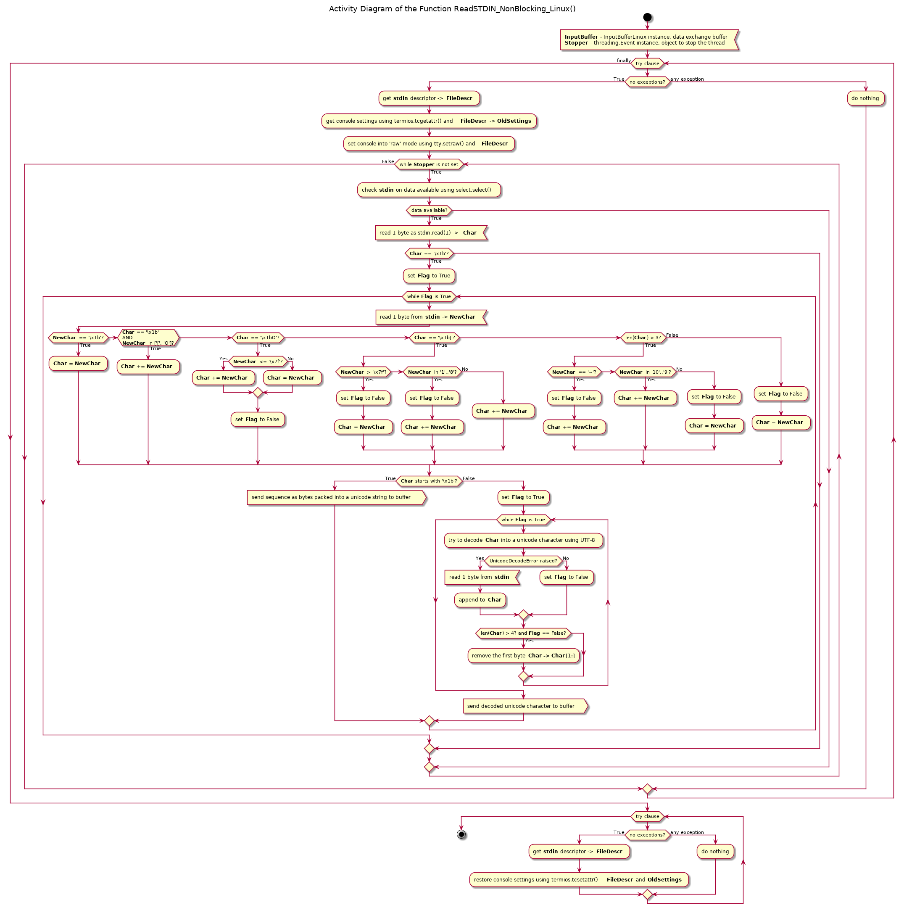

The buffer class **InputBufferLinux** has two public instance methods: **put**() and **get**() - to place the data into the buffer and to retrieve it from the buffer respectively. It also implements a read-only property **IsReady** with the boolean value - if any data can be retrieved from the buffer, and two helper 'private' methods.

The property **IsReady** (see figure below) checks the data timer and purges the output buffer if the timer has expired. Then, if the output buffer still contains data the True value is returned, otherwise - False.

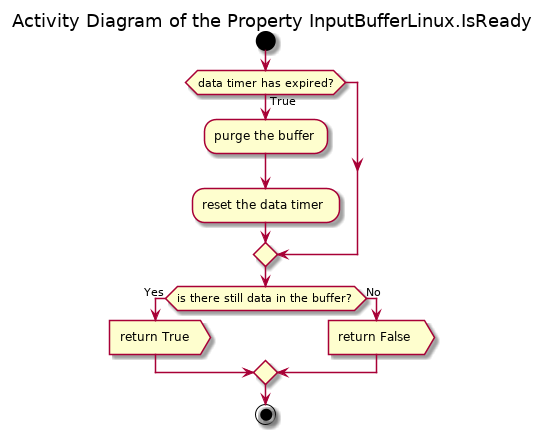

The public instance method **get**(), at first, checks the data timer and purges the output buffer if the timer has expired. If the output buffer still contains data, this data is returned and the output buffer is cleared out. Otherwise the value None is returned.

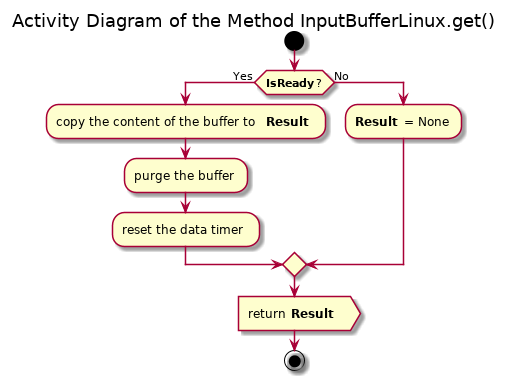

The public instance method **put**() is called from the secondary thread, which listens to the **stdin**, as soon as a proper input data in the **stdin** is available. It deletes the previously stored data, copies the new data into the buffer and resets the data timer.

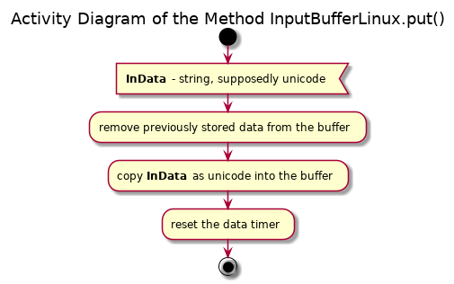

The 'user interface' class **KeyboardListenerLinux** has one public instance method **GetKeystroke**(), initialization and destruction methods.

The initialization method creates instances of the **InputBufferLinux**, **treading.Event** and **threading.Thread** classes and starts the listener function in a separate thread.

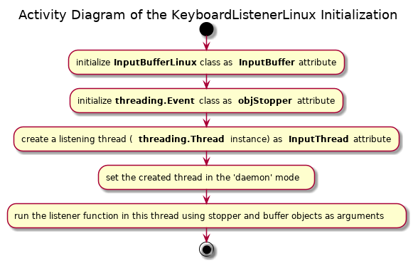
 
 The 'destructor' method of this class checks if the listening thread is alive. If the thread is alive, it sets the stopper event object, which must stop the **stdin** listening as soon as the last unfinished input sequence is complete, or 'immediately', if there is no pending input. Then it waits for the tread to finish and join the main thread.
 
 The listener thread object is 'deleted'.
 
 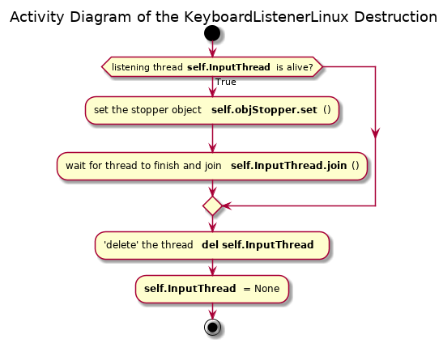
 
 The **GetKeystroke** method runs in a loop until it can copy a keystroke from the buffer object. It calls the method **InputBufferLinux.get**(). If the returned value is not None, the method exits the loop and return this value. Otherwise, it waits for the twice amount of time as defined by the module global variable DEF_TIME_DELAY before making the new call to **InputBufferLinux.get**().
 
 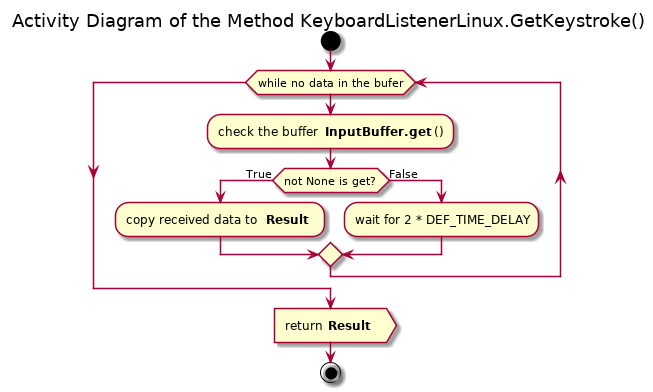

### Remaining Issues

* The ESC key press cannot be registered as a single keystroke
* The ESC key press followed by other key presses may be interpreted either as a proper CSI or SS3 sequence (as if a single 'special' key is pressed) or some unknown CSI / SS3 sequence, or anything but the last keystroke can be dropped, e.g.:
  - ESC + '[' + 'A' -> proper sequence '\x1b[A', same as up arrow cursor key
  - ESC + '[' + 'a' -> improper sequence '\x1b[a', but accepted
  - ESC + '[' + '1' +'a' -> not a sequence -> 'a' (rest is dropped)
  - ESC + ESC -> the first ESC is dropped, waits for further input
* Only a single instance of the class **KeyboardListenerLinux** can run properly; 2 or more instances cause a conflict ('racing' condition for the input) and the console may not be restored properly. Make sure to 'delete' (**del** statement) an existing instance before creation of a new instance
* If the **stdin** listening thread is not terminated properly before the exiting the program, the console may remain in the 'raw' (not 'cbreak') mode. Make sure 'delete' (**del** statement) an existing instance of the **KeyboardListenerLinux** class before exiting the program.

## Usage

```python
from sudoku_py.ui.cli.keystroke_linux import KeyboardListenerLinux
#instantiate the listener class - the second thread is started!
MyListener = KeyboardListenerLinux()
#listening loop
while SomeCondition:
    Key = MyListener.GetKeystroke()
    #do something useful
#do not forget to 'delete' the object / stop the second thread as soon as you
#don`t need it anymore
del MyListener
#do some other stuff
```

## API Reference

### Globals

DEF_TIME_DELAY = 0.005 : positive floating point, the delay time in seconds, during which the **stdin** is queried for the available data and determins the rate at which the bytes are taken from the standard input

DEF_LIFE_TIME = 0.5 : positive floating point, the effective 'lifetime' in seconds of the data in the buffer before it is erased unless claimed. The time elapsed since the last transfer into the buffer is compared to this value, and the data is erased if this time threshold has been exceeded. Note that if another keystroke is registered during this time period, the new data is simply added to the buffer and the time counter is reset.

Both values should be adjusted for the 'pace' of the application, i.e. how often the input from the user is required.

### Functions

#### ReadSTDIN_NonBlocking_Linux(InputBuffer, Stopper)

Signature:

InputBufferLinux, threading.Event -> None

Args:

  - *InputBuffer*: InputBufferLinux instance, where the data from the sdtin will be placed
  - *Stopper*: threading.Event instance, used as an indicator to stop listen to the **stdin**; use the method **stop**() of this object to do so

Description:

Implements the listening to the stdin in the non-blocking manner. Changes the console to the 'raw' mode (via tty module). Enters the loop, which can be stopped by setting the Stopper object in the corresponding state, and queries the stdin for the available data (using select.select). If data is available the buffer of the stdin is read out one byte at a time, and the data is stored in the internal buffer of the function, until a proper bytes sequence is accumulated, which is converted into Unicode (and decoded using UTF-8 if required) and sent out.

Common situations:

* 1st read byte is '\x1b' - either a single ESC or CSI / SS3 sequence - read more bytes until a proper sequence is formed:
  - '\x1bO' + any ASCII character - 3 bytes SS3 sequence
  - '\x1b[' + any letter (ASCII char), but not a number - CSI 3 bytes
  - '\x1b[' + 1 or more numbers + '~' - CSI 4+ bytes with a terminator
  - An ESC ('\x1b') read before an end of a proper CSI / SS3 sequence is treated a broken sequence; the previous input is dropped, a new sequence is started
  - Any other character which breaks the CSI / SS3 patterns above leads to discarding the previous input; the last received character is treated as the first byte in an ASCII / Unicode symbol input, see below
* 1st byte is not '\x1b' but is less then '\x80' - proper ASCII character
* 1st byte is greater than '\x7f' - part of the UTF-8 encoded Unicode character - accumulate more bytes until decoding can be properly performed (check with each obtained byte)
  - If accumulated sequence is longer than 4 bytes, drop the first byte and try to decode; if fails - keep on getting new bytes and dropping the first one until can be decoded

Upon exit (or exception) tries to set the terminal back to the intial state. If this happends during the automatic garbage collection at the exit from a program, the stdin can be no longer available, so the terminal will remain in the 'raw' mode. This function is intended to be run in a separate thread, so make sure to stop the listening and terminate the thread manually before exiting the program.

Note that the duration of the stdin quering per itteration (waiting) is defined by the module global variable (constant) DEF_TIME_DELAY

Known Issues:

* An ESC key alone cannot be detected, will wait until another key press
* ESC + any key but '[' or 'O' (capital leter O) - the last key alone is registered, ESC is dropped
* ESC + 'O' + any byte < '\x80' - treated as an SS3 sequence, which may be incorrect
* ESC + 'O' + any byte > '\x80' - ESC + 'O' is dropped, the rest is processed as an Unicode character
* ESC + 'O' + any byte < '\x80' but not a number '1' to '8' - treated as a CSI 3butes sequence, which may be incorrect
* ESC + '[' + any number '1' to '8' - treated as 3+ bytes CSI sequence, which may be:
  - properly ended with '~'
  - continued with any number ('0' to '9')
  - terminated with any not number character; anything but the last byte is dropped, the last byte is processed as a new control or ASCII / Unicode character byte sequence
* ESC + '[' + any byte > '\x80' - ESC + '[' is dropped, the rest is processed as an Unicode character

### class InputBufferLinux

Buffer to store the processed input from the stdin. Intended to be used as an instance shared by two threads: the stdin listener and the 'user interface' object. The input from the stdin is supposed to be already processed, i.e. it may be:

* An ASCII character (< u'u0080'), which may be represented by a single byte using UTF-8 encoding, stored as a unicode string
* A non ASCII Unicodecharacter (>= 'u0080'), which is represented by 2 or more byte using UTF-8 encoding, stored as a unicode string
* An ESC CSI / SS3 sequence of 3 or more ASCII characters (bytes) starting with '\xb1O' or '\xb1[' and stored as a unicode string, e.g. u'xb1[A' for up arrow cursor key press

Any input received from the stdin listener purges the previous data from the buffer, puts the received data into the buffer and resets the data counter.

The unclaimed data is removed from the buffer and not returned to the 'user interface' is the data timer has expired, i.e. the data have been stored for longer than DEF_LIFE_TIME (global variable).

When the data is claimed by the 'user interface', its is removed from the buffer and returned (unless expired) to the caller. The data timer is reset.

#### Instance Attributes

  - *IsReady*: bool, read-only property with the True state indicating that there is data available in the buffer
  - *_strOutBuffer*: unicode string, 'private', the buffer itself
  - *_dLastTime*: positive floating point, 'private', time is seconds passed since the last data transfer from the input into the output buffer

#### Initialization

No arguments are required, and none is accepted

#### Instance Methods

**put**(strData)

Signature:

str OR unicode -> None

Args:

  - *strData*: string, unicode supposedly, the data to be put into the buffer

Description:

Method to put one or more characters (ASCII or encoded unicode) into the buffer. Each such trnsfer clears the buffer from the previously stored content and resets the data timer.

**get**()

Signature:

None -> unicode OR None

Returns:

  - *unicode*: the entire content of the buffer if it is not empty
  - *None*: if the buffer is empty

Description:

Method to retrieve the content of the ouput buffer. Note that the output buffer is checked for how long the data is stored because of the call to the property *IsReady*, which may result in clearing of the buffer. So, either call this method directly after the check for the data availability with the property IsReady, or check the result is it None or a unicode string.

### class KeyboardListenerLinux

Linux (POSIX) specific implementation of the keyboard listener, which detects and returns (as a unicode string) the made keystroke. The special keys, like F1 to F12, PageUp / PageDown, cursor keys, etc. are returned as the ASCII CSI or SS3 sequences (as generated by the console itself), which are stored as ASCII codes in the unicode string. Real unicode characters (e.g. generated by the Russian keyboard layout, etc.) are treated properly if the underlying console treats the keystrokes as the UTF-8 encoded sequence of bytes.

Make sure to 'destroy' an existing instance of this class before creating a new one, as well as to explicitely 'destroy' the last used instance before exiting the program. Otherwise the console will behave strangly as well as some sdtin related threading problems may occur.

#### Instance Attributes

  - *InputBuffer*: InputBufferLinux class instance, the buffer to store the processed input received from the **stdin**
  - *objStopper*: threading.Event class instance, helper event object used only for stoping the keyboard listener
  - *InputThread*: treading.Thread instance, the secondary thread, where the keyboard listener function is run

#### Initialization

No arguments are required, and none is accepted

#### Destructor

No arguments are required, and none is accepted

#### Instance Methods

**GetKeystroke**()

Signature:

None -> unicode

Returns:

  - *unicode*: the last registered keystroke as a unicode character (decoded) or ASCII CSI or SS3 characters sequence in an unicode string

Description:

Blocking method, which listens to the keyboard input (keystroke), until such event is registered, and returns it. Based on the periodic quering the buffer object for the available processed data. If data is available the entire buffer is copied and returned; the buffer itself is cleared.

Otherwise the method sleeps for the twice the time period defined by the module global variable (const) DEF_TIME_DELAY before the next query. The buffer itself is populated asynchroniously from the stdin using another thread.

## Tested Platforms

* Linux Mint 19 (Tara) 64 bit (kernel v4.15.0-34) with CPython v2.7.15rc1 64 bit
  - In Visual Studio Code v1.27.2
  - In Geany v1.32 (Bemos)
  -  Directly in Mate Terminal v1.20.0