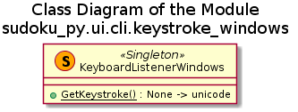

# Module ui.cli.keystroke_windows

## Goals

This module implements the Microsoft Windows specific keyboard listener, which should detect a keyboard`s key press event and return a string (unicode) representation of the pressed key. This module is complementary to the POSIX keystroke listener implementation (see [documentation](./ui_cli_keystroke_linux.md)), as it is defined in the problem analysis for the ui.cli.terminal_utils module (see [documentation](./ui_cli_terminal_utils.md))

The expected *modus operandi* is that a CLI user interface element (menu, dialog, etc.) will wait for the user input (key press) and perform some action afterwards based on the user input. Therefore, the process of the keyboard listening may be blocking. Such an UI element will expect either a Latin letter (small or capital, no diacritic signs) or a number entered by the user as the choice of an item / option. Thus, for instance, Shift+'1' keypress (resulting in the '!' character with English QWERTY layout) is not a valid input, which should be clearly differentiated from the plain '1' key press. In short, the result returned by the keyboard listener should be identical to the situation when a single character is entered via **stdin** (using **raw_input**() function), but without the necessity to finish the input with the Enter key. This also means that a letter key press using non-English keyboard layout may result in a different character being returned.

## Requirements

* The 'normal' keys - Latin letters (capital and small), numbers, arithmetic signs, punctuation signs, etc. - i.e. all characters with ASCII codes from 32 ('\x20') to 126 ('\x7e') inclusively - must be captured and properly represented; i.e. the keystroke 'q' + Shift (without Caps Lock) or simply 'q' with the Caps Lock should yield 'Q', '[' with Shift - '{', etc.
* The keys corresponding to the control symbols within ASCII - Esc, Backspace, Enter, Tab - must also be captured and returned in an unambiguous manner - either as C escape sequences '\r', '\b', '\t', or by their hex-code, e.g., '\x1b'
* The 'special' keys - cursor keys, Delete, Insert, Home, End, PageUp, PageDown, etc., which are represented by the (platform specific) escape sequences - must be captured and returned as an unambiguous string, e.g., as hex-code
* The 'modifier' keys - Shift, Alt, Ctrl - alone should not be registered as a key press, only in combination with the key that they modify; the resulting control sequences (like Cntrl-C, etc.) should be treated in the same way as the 'special' keys above
* The true Unicode characters as the resul of the key press on the non-English keyboard layout (e.g. Cyrillic) must be detected and properly represented as a Unicode character (u'\uxxxx' format)

## Problem Analysis

The internet search quickly revealed that the easiest and the most reliable way is to use the MS Windows specific module **msvcrt** and the function **getch**() from it. A fine example of this approach can be found at [^1].

Futher analysis and experimentation revealed that the function **getwch**() from the same module suits better, since it returns the Unicode input (e.g. Cyrillic leter) as a single unicode character, already in the u'\uxxxx' form, even though the Windows` console itself cannot properly display it (as tested on Windows 8 and 10). The control codes (specal keys, like cursor or F1) are still generated as two ASCII bytes with the first one being '\x00' or '\xe0', so the second byte is to be read explicitely.

**Note**: on Windows 10 the Unicode characters can be used in the system console, and they are displayed correctly. Furthermore, they are displayed correctly in the 'echo' of the Python raw_input() function, and are stored as '\uxxxx' characters in the result. However, an attempt to print out (using print or sys.stdout.write()) such a character (not Latin / printable ASCII) results in an exception. Apparently, the problem is with the Python (tested on CPython v2.7.15).

### References

[^1]: [MagMax at GitHub](https://github.com/magmax/python-readchar) . Original authors are [Danny Yo & Stephen Chappel at code.activestate.com](http://code.activestate.com/recipes/134892)

## Design

The module implements a single class with a single class method, thus there is no need to instantiate it. Furthermore, this class is intended to be used as a singleton.



The class method **KeyboardListenerWindows.GetKeystroke**() is blocking. It loops until a keypress event is registered, see **msvcrt.kbhit**(). After a keypress event is detected, it reads a wide character from the input using **msvcrt.getwch**(). If the read character is 'u\x00' or u'\xe0' - the second character is read out and appended to the first.

_Activity.png)

## Usage

```python
from sudoku_py.ui.cli.keystroke_windows import KeyboardListenerWindows

while SomeCondition:
    Key = KeyboardListenerWindows.GetKeystroke()
    #do something with the input

```

***Warning***: this module will work only on MS Windows systems. On any other system it will result in the **ImportError** exception.

## API Reference

### Class KeyboardListenerWindows

#### Class methods

**GetKeystroke**()

Signature:

None -> unicode

Returns:
  - *unicode*: the last registered keystroke as a unicode character or 2 bytes escape characters sequence in an unicode string, starting with either '\x00' or '\xe0'.

Description:

Blocking class method to listen to the keyboard and to return the keystroke made as a unicode string.

The special keys, as cursor keys, page up / down, F1, etc., are returned as escape sequences - 2 bytes starting with '\x00' or '\xe0' within a unicode string.

Unicode support. The unicode characters are already properly generated in the u'\u...' form by the console input, but they cannot be displayed in the console, at least in Windows 8 and 10.

## Tested platforms

* MS Windows 8 64 bit with CPython v2.7.9 32 bit
  - In Visual Studio Code v1.27.2
  - In Geany v1.24 (Sakai)
  - Directly in the console
* MS Windows 10 (Home, 64 bit) with CPython v2.7.15 64 bit
  - In Visual Studio Code v1.27.2
  - Directly in the console