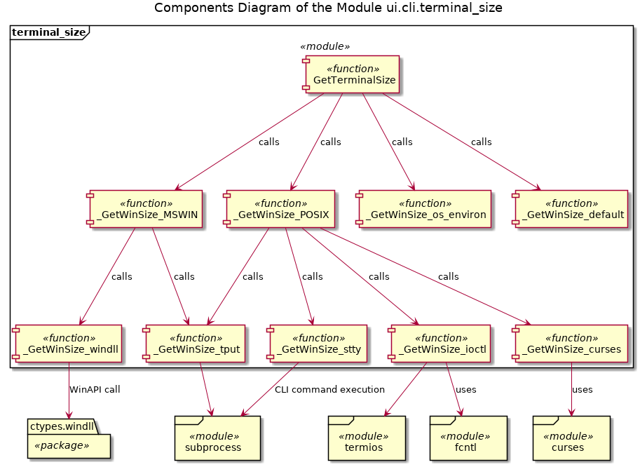
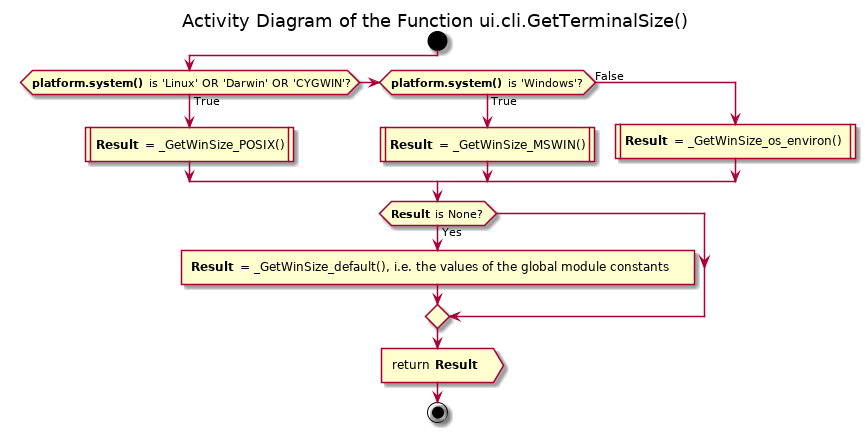
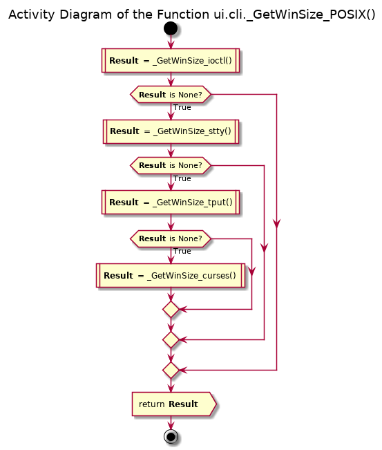
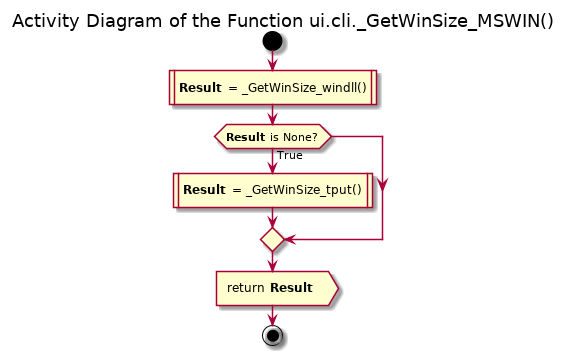
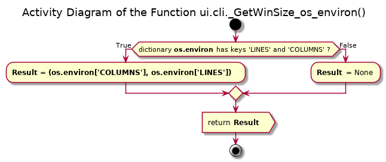
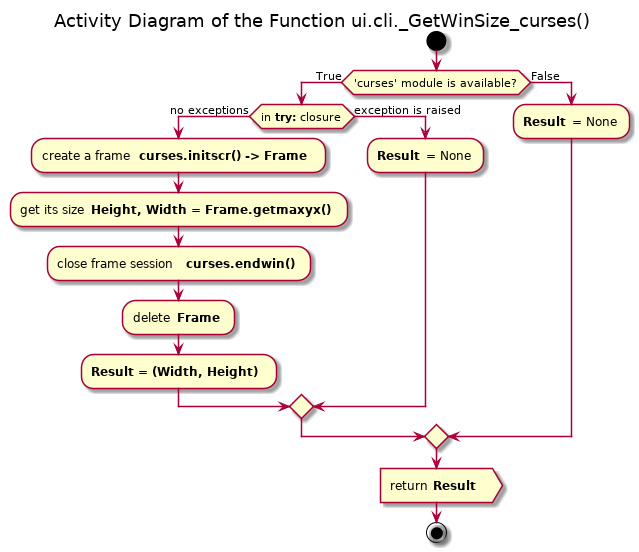
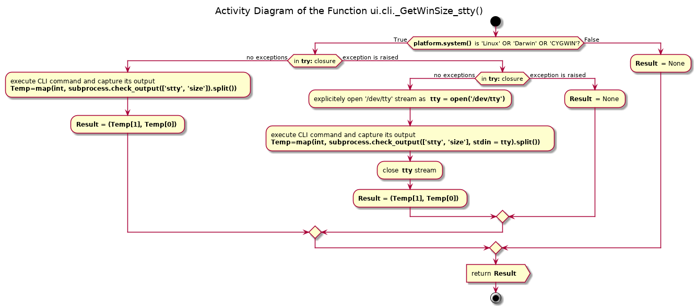
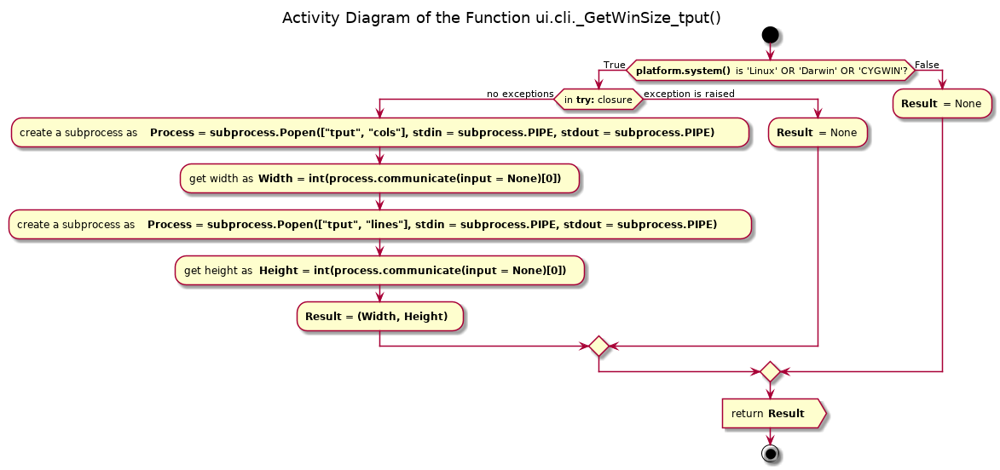
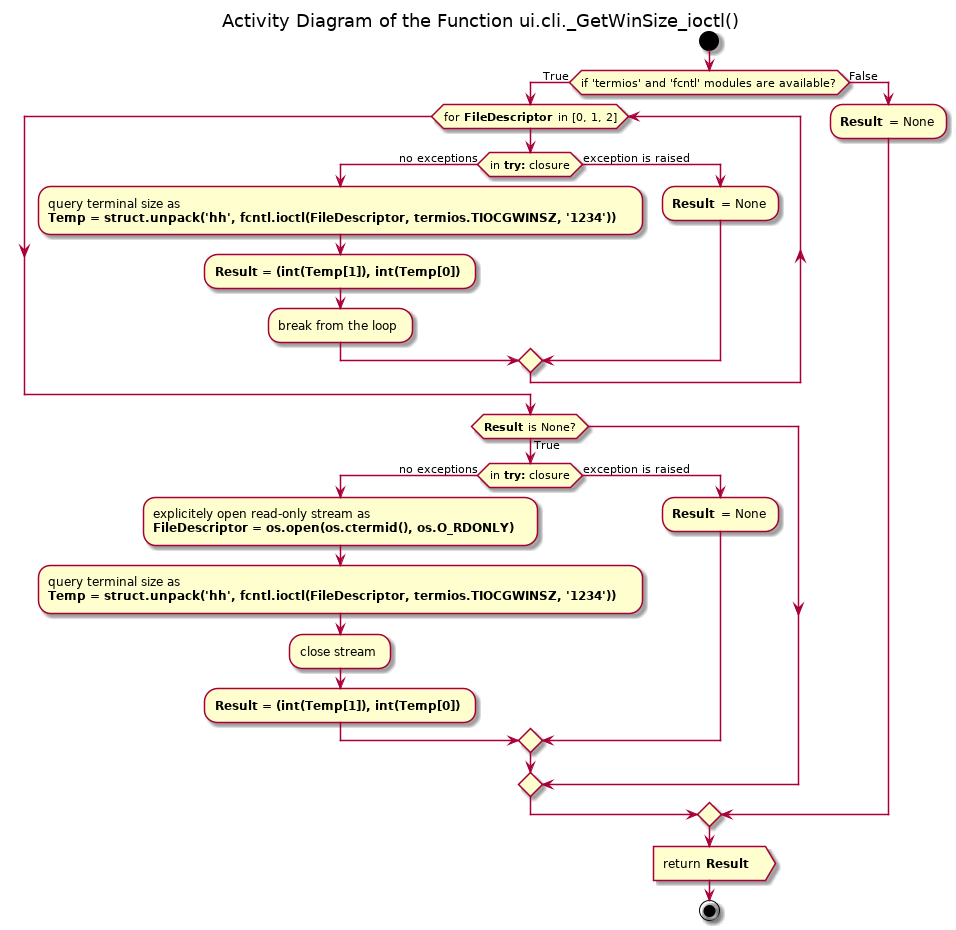
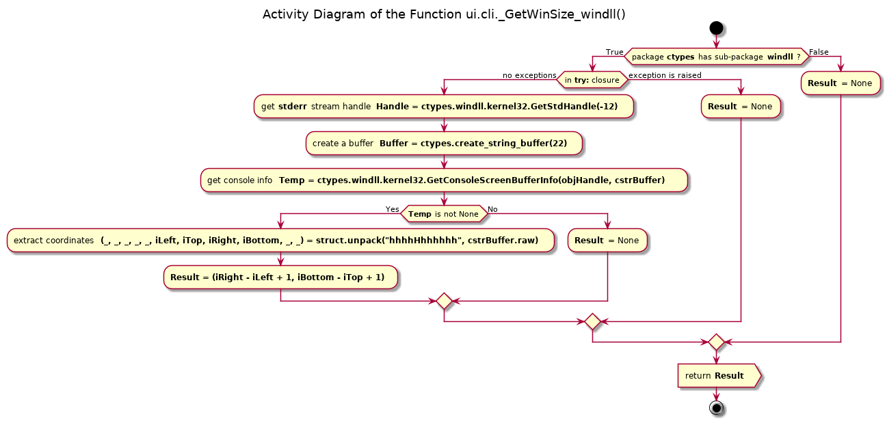

# Module ui.cli.terminal_size

## Goals

This module implements the platform independent function to obtain the current terminal (console) size - width and height in characters. The functionality of this module is part of the functionality defined in the problem analysis for the **ui.cli.terminal_utils** module (see [documentation](./ui_cli_terminal_utils.md)).

The intended use of this module is that a function or a class method defined in another module queries the current terminal size without any arguments, and the current size is returned as an unpacked tuple of two integeres.

## Requirements

The module must provide a single 'public' function, which is to be called without arguments, and which will return two integer numbers within an unpacked tuple - the width (number of columns == length of a single full line in characters) and height(number of lines visible) displayed by the console. Thus, the signature of this funcion is:

None -> int, int

## Problem Analysis

Unlike Python 3.x series (at least, starting with version 3.3) there is no standard and platform independent function in Python 2.7 to obtain the current terminal size. The Internet search <a id="bref1">[<sup>1</sup>](#ref1)</a> yielded the following options:

* MS Windows specific:
  - ctypes.windll.kernel32.GetConsoleScreenBufferInfo() function, which accesses WinAPI functionality
* POSIX systems (Unix, Linux, macOS X) specific (might also work within CYGWIN environment in Windows)
  - fcntl.ioctl() function, which is a wrapper for the Unix / Linux system call **ioctl**()
  - executing 'stty size' console command in a subprocess and capturing its output
  - executing 'tput cols' and 'tput lines' commands in a subprocess
  - using curses.initscr().getmaxyx()
* Using os.environ dictonary - keys 'LINES' and 'COLUMNS' - does not work on Windows and Linux

The ultimate fallback option, when all other methods have failed, is to return the default 80 x 25 size.

### References

<a id="ref1">[1]</a> [Stackoverflow question 566746](https://stackoverflow.com/questions/566746/how-to-get-linux-console-window-width-in-python) [&#x2B0F;](#bref1)

## Design

The module implements only a single 'public' function **GetTerminalSize**(), which is intended to be called from the outside the module, but this function, in fact, aggregates all options discussed in the [Problem Analysis](#Problem-Analysis) chapter, see the Components Diagram of the module.



The function **GetTerminalSize**() checks the *effective* type of the operational system, and calls the 'private' aggregation function **_GetWinSize_POSIX**() for the *Linux*, *BSD* / *MacOS X* (based on the *Darwin* kernel) systems as well as for the *CYGWIN* environment within the MS Windows OS; the 'private' aggregation function **_GetWinSize_MSWIN**() for the MS Windows (not within the POSIX emulation layer); and the function **_GetWinSize_os_environ**() for other OSes. If the result of the corresponding function call is *None*, i.e. failure, the default terminal size is returned, which is retrieved via the call to **_GetWinSize_default**(). See the Activity Diagram of this function below.



The function **_GetWinSize_POSIX**() tries to obtain the size of the console by calling the 'private' helper functions in the following order: **_GetWinSize_ioctl**(), **_GetWinSize_stty**(), **_GetWinSize_tput**() and **_GetWinSize_curses**() - until one of them returns not *None* value, or all variants have been tried.



The function **_GetWinSize_MSWIN**(), at first, tries to obtain the console size by calling the 'private' helper function **_GetWinSize_windll**(). If failed (returned value is *None*) - the second option - **_GetWinSize_tput**() - is tried.



The alternative variant - the 'private' helper function **_GetWinSize_os_environ**(), see below, returns the values bound to the keys *COLUMNS* and *LINES* from the dictionary **os.environ** - but only if both keys are present. Finally, the fallback option - the 'private' helper function **_GetWinSize_default**() - simply returns the values of the module`s global variables *DEF_CONSOLE_COLUMNS* and *DEF_CONSOLE_LINES*.



Te helper function **_GetWinSize_curses**() attempts to create a new *frame* (output) object using the **curses** module, to query its size, and to destroy the created frame.



Both helper functions **_GetWinSize_stty**() and **_GetWinSize_tput**() wrap the execution of the CLI (shell) commands as a *subprocess*.

The function **_GetWinSize_stty**() executes the shell command 'stty size' as a subprocess and simply captures and processes its result. This approach may fail if the caller does not receive the input directly from the **stdin**, but the ouput of some other process is being piped into the caller`s process. In this case, the handler of the stream '/dev/tty' is obtained explicitly as *tty*, and the same shell command is executed again while passing the keyword argument *stdin = tty* into the subprocess.check_output() function.



The function **_GetWinSize_tput**() executes two shell commands after each other - 'tput cols' and 'tput lines' - to obtain the width and height of the console as subprocesses using piping.



The function **_GetWinSize_ioctl**() wraps the Linux / Unix system call **ioctl**(). At first, it tries to determine the console size using this system call applied to the file descriptors of the **stdin**, **stdout** and **strerr** streams and to unpack the result into the pair of integers, until succeeded with any of the descriptors, or all options have been tried. If it fails with all three streams, the **os.ctermid**() stream is opened explicitely in the *read-only* mode, and the same procedure is applied to it.



Finally, the function **_GetWinSize_windll**() wraps the WinAPI call and unpacks its result, extracting only the relevant parameters - the coordinates of the console frame, from which the current size of the console is calculated.



## Usage

```python
from sudoku_py.ui.cli.terminal_size import GetTerminalSize()

Columns, Lines = GetTerminalSize()
```

## API Reference

### Globals

DEF_CONSOLE_LINES = 25 : integer, the default number of lines in the terminal, if the real size cannot be determined

DEF_CONSOLE_COLUMNS = 80 : integer, the default number of columns in the terminal, if the real size cannot be determined

### Functions

#### GetTerminalSize()

Signature:

None -> int, int

Returns:

  - **tuple(int, int)**: width (columns) and height (lines) of the console

Description:

Attempts to define the console size using the platform specific options:
  * _GetWinSize_POSIX() for POSIX systems
  * _GetWinSize_MSWIN() for MS Windows systems
  * _GetWinSize_os_environ() for other systems

If the platform specific methods have failed, the fallback option is to return the values of the (module) global constants DEF_CONSOLE_COLUMNS and DEF_CONSOLE_LINES.

## Tested Platforms

* Linux Mint 19 (Tara) 64 bit (kernel v4.15.0-34) with CPython v2.7.15rc1 64 bit
  - In Visual Studio Code v1.27.2
  - In Geany v1.32 (Bemos)
  - Directly in Mate Terminal v1.20.0
* MS Windows 8 64 bit with CPython v2.7.9 32 bit
  - In Visual Studio Code v1.27.2
  - In Geany v1.24 (Sakai)
  - Directly in the console
* MS Windows 8 64 bit with CPython v2.7.15 64 bit
  - In Visual Studio Code v1.25.1
  - In Geany v1.33 (Gorgon)
  - Directly in the console
* MS Windows 10 64 bit with CPython v2.7.15 64 bit
  - Directly in the console
  - In Visual Studio Code v1.27.2